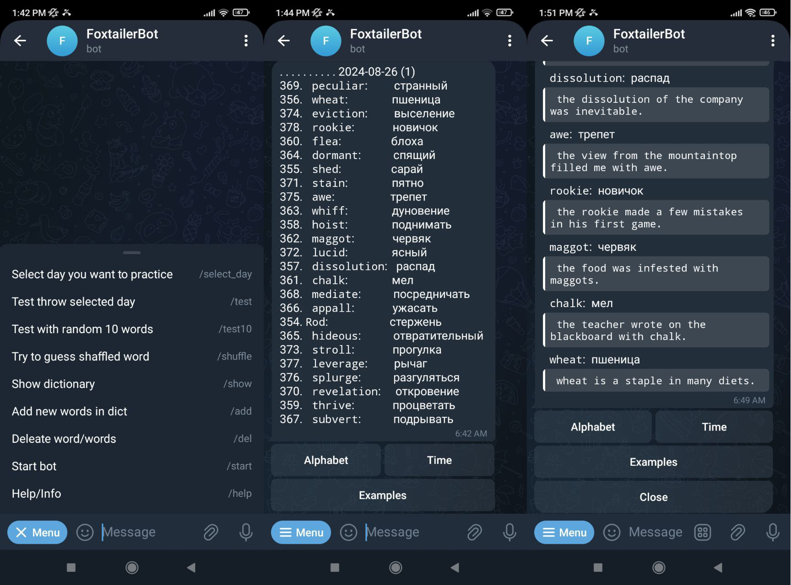
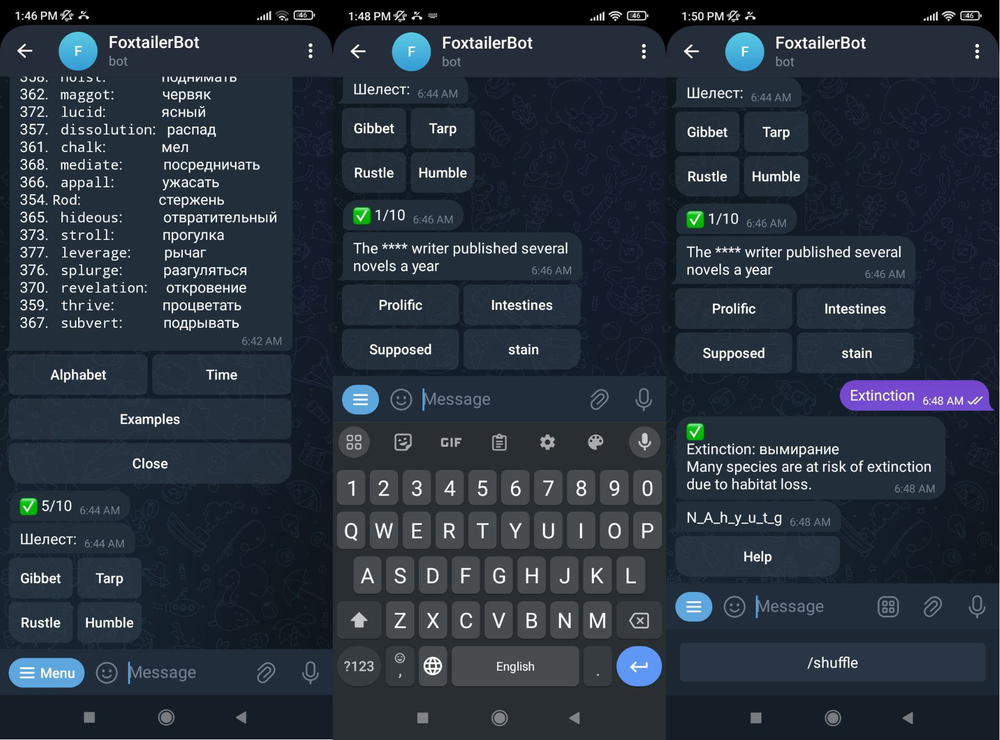

# asistent-tgbot-

- Python
- telegram API
- SQL
- aigram 3

A bot that helps users learn a new language. It adds words and examples to a database and offers different games and tests based on these words.

